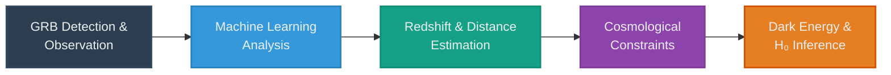
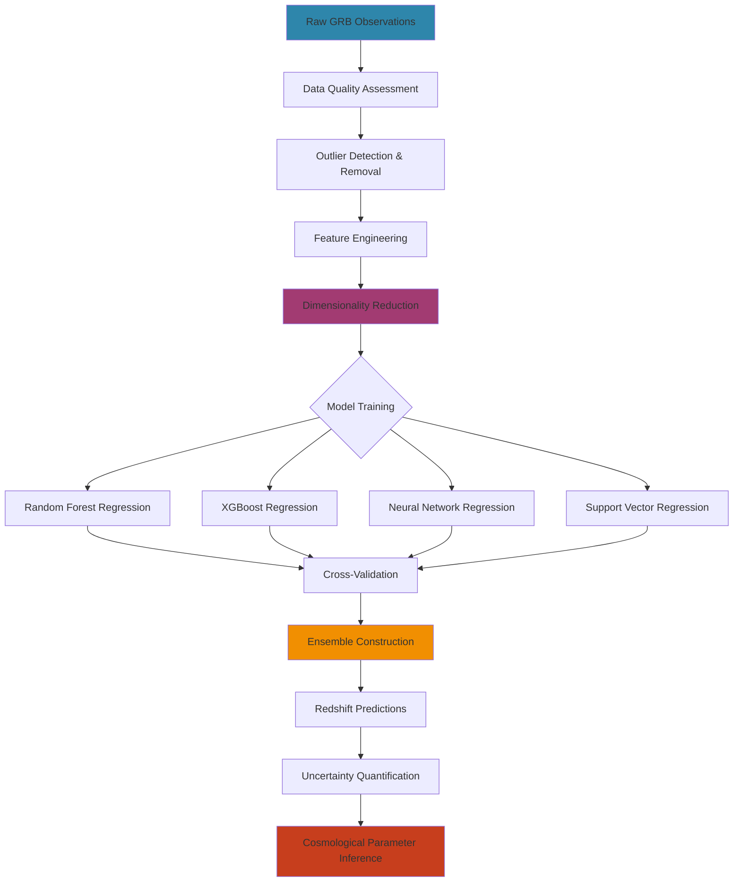

# GRB-ML: Machine Learning-Based Redshift Estimation for Gamma-Ray Bursts

[](https://opensource.org/licenses/MIT)
[](https://www.python.org/downloads/)
[](https://github.com/Adrita-Khan/GRB-ML/issues)
[](https://github.com/Adrita-Khan/GRB-ML/stargazers)
---

> **Note:** This project is ongoing and subject to continuous advancements and modifications.

---

<p align="center">
  
</p>


<p align="center">
<i>

</i>
</p>


## Overview

This project uses machine learning to study gamma-ray bursts (GRBs) as potential cosmological standard candles. It focuses on improving GRB standardization and refining empirical relations such as the Amati and Yonetoku relations. By analyzing correlations between observables and cosmological parameters, the project aims to constrain the Hubble constant and dark energy density and improve redshift estimation for studies of the universe's expansion.




**Collaboration:** This is a project of [CAPP](https://www.uj.ac.za/faculties/science/departments-2/physics/research/astrophysics/the-centre-for-astro-particle-physics-capp/) in collaboration with [CASSA](https://cassa.site/) and [CCDS](https://ccds.ai/).

---

## Key Features & Objectives

| Category | Description |
|----------|-------------|
| **Correlation Analysis** | Identify and analyze correlations between observable GRB quantities and cosmological parameters |
| **Cosmological Constraints** | Refine measurements of Hubble constant and dark energy density using ML-driven approaches |
| **Empirical Relations** | Improve standardization beyond traditional Amati and Yonetoku relations |
| **Advanced ML Models** | Random Forest, XGBoost, Neural Networks, and ensemble methods for robust predictions |
| **Data Preprocessing** | Comprehensive pipeline for cleaning and preparing GRB observational data |
| **Feature Selection** | Advanced dimensionality reduction techniques to identify optimal input parameters from high-dimensional data |
| **Visualization Tools** | Interactive plots and dashboards for data exploration |
| **Model Validation** | Robust cross-validation and testing frameworks for reliability |

---

## Background

### Context

Astrophysical data is growing rapidly, making traditional and manual analysis inefficient. Machine learning provides an effective way to handle large datasets and identify patterns in astrophysical observations.


### Why Machine Learning?

| Advantage | Description |
|-----------|-------------|
| **Handle Large Data** | ML processes massive datasets efficiently |
| **Identify Patterns** | ML uncovers hidden relationships and detects faint signals |
| **Accelerate Discovery** | Automates repetitive tasks, allowing focus on complex analysis |
| **Uncover New Physics** | ML can detect previously undetectable structures |

### Cosmological Standard Candles

In cosmology, standard candles are objects with known intrinsic brightness. This allows distances to be measured using the inverse-square law of light and makes standard candles essential for building the cosmic distance ladder and studying the universe's expansion.

### Gamma-Ray Bursts (GRBs)

Gamma-ray bursts (GRBs) are extremely energetic events detected across multiple electromagnetic bands. Because they can be observed at much higher redshifts than Type Ia supernovae, they are promising alternative standard candles. Studying GRBs can help constrain cosmological parameters such as the Hubble constant and dark energy density.

Despite their potential, GRBs are not perfect standard candles. Empirical relations such as the **Amati relation** (linking total energy release to spectral peak energy) and the **Yonetoku relation** (linking peak luminosity to peak energy) have been proposed. These relations connect observable quantities to cosmology-dependent parameters and can be used to constrain cosmological models.

---

## Dataset

### Data Sources

The project utilizes GRB observational data from multiple sources:

| Source | Description |
|--------|-------------|
| **Swift-BAT GRB Catalog** | Comprehensive catalog of GRBs detected by Swift |
| **Fermi-GBM Catalog** | High-energy gamma-ray data with 306 features for feature selection analysis |

### Data Structure

> **Note:** Subject to amendments

```
Data/
├── grb_catalog.csv          # Main GRB observational data
├── swift_bat_data.csv       # Swift-BAT specific measurements
├── fermi_gbm_data.csv       # Fermi-GBM observations
├── redshift_measurements.csv # Spectroscopic redshifts
└── processed/               # Cleaned and preprocessed data
```

### Key Parameters

| Category | Parameters |
|----------|------------|
| **Observable Quantities** | Peak energy (Ep), fluence, peak flux, duration (T90) |
| **Derived Parameters** | Isotropic energy (Eiso), peak luminosity (Liso) |
| **Cosmological Data** | Redshift (z), luminosity distance (DL) |

### Accessing Fermi-GBM Data

You can retrieve specific columns from the [FERMIGBRST - Fermi GBM Burst Catalog](https://heasarc.gsfc.nasa.gov/db-perl/W3Browse/w3table.pl?tablehead=name%3Dfermigbrst&Action=More+Options) using the HEASARC Browse interface.

**Required Columns:**

| Column Name | Description |
|-------------|-------------|
| `name` | GRB identifier |
| `t90` | Duration of burst (90% of total counts) |
| `t90_error` | Error in T90 measurement |
| `flnc_band_alpha` | Band function alpha parameter |
| `flnc_band_alpha_pos_err` | Positive error in alpha |
| `flnc_band_alpha_neg_err` | Negative error in alpha |
| `flnc_band_beta` | Band function beta parameter |
| `flnc_band_beta_pos_err` | Positive error in beta |
| `flnc_band_beta_neg_err` | Negative error in beta |
| `flnc_band_epeak` | Peak energy (keV) |
| `flnc_band_epeak_pos_err` | Positive error in Epeak |
| `flnc_band_epeak_neg_err` | Negative error in Epeak |
| `flnc_band_ergflnc` | Energy fluence (erg/cm²) |
| `flnc_band_ergflnc_error` | Error in energy fluence |

---

## Methodology





### Machine Learning Approaches

#### Models Implemented

| Model Type | Specific Algorithms |
|------------|---------------------|
| **Regression Models** | Random Forest, XGBoost, Neural Networks, Support Vector Regression |
| **Feature Engineering** | PCA, feature selection, outlier handling |
| **Ensemble Methods** | Voting regressors, stacking classifiers |

#### Feature Selection Strategy

The project employs advanced feature selection techniques to handle high-dimensional data from the Fermi catalog. With 306 features available, dimensionality reduction is critical for:
- Identifying the most informative input parameters for redshift estimation
- Reducing computational complexity and preventing overfitting
- Improving model interpretability and generalization performance
- Extracting physically meaningful relationships from observational data

#### Cosmological Analysis

| Technique | Application |
|-----------|-------------|
| **Empirical Relations** | Refining Amati and Yonetoku relations |
| **Parameter Estimation** | MCMC methods |
| **Model Comparison** | AIC and BIC for model evaluation |
| **Uncertainty Quantification** | Bootstrap resampling |


---

## References

1. [MNRAS Article](https://academic.oup.com/mnras/article/529/3/2676/7611713)
2. [HEASARC Fermi GRB Browse](https://heasarc.gsfc.nasa.gov/W3Browse/fermi/fermigbrst.html)
3. [Fermi GBM Data Analysis](https://fermi.gsfc.nasa.gov/ssc/data/analysis/gbm/)
4. [Ioffe zGRBs Part 2](https://www.ioffe.ru/LEA/zGRBs/part2/index.html)
5. [Fermi GBM Data Tools - Data Finders](https://fermi.gsfc.nasa.gov/ssc/data/analysis/gbm/gbm_data_tools/gdt-docs/notebooks/DataFinders.html)

---

## License

This project is licensed under the MIT License - see the [LICENSE](LICENSE) file for details.

---

## Contact

**Adrita Khan**

[Email](mailto:adrita.khan.official@gmail.com) | [LinkedIn](https://www.linkedin.com/in/adrita-khan) | [Twitter](https://x.com/Adrita_)

---


## Contact

**Adrita Khan**  

<div align="center">

[](mailto:adrita.khan.official@gmail.com)
[](https://www.linkedin.com/in/adrita-khan)
[](https://x.com/Adrita_)
[](https://github.com/Adrita-Khan)

</div>

---

<div align="center">

### Project Statistics


---

*This repository serves as a starting point for using Machine Learning to improve the standardization of GRBs as cosmological probes, ultimately contributing to a better understanding of the universe's expansion and the cosmic distance ladder.*
